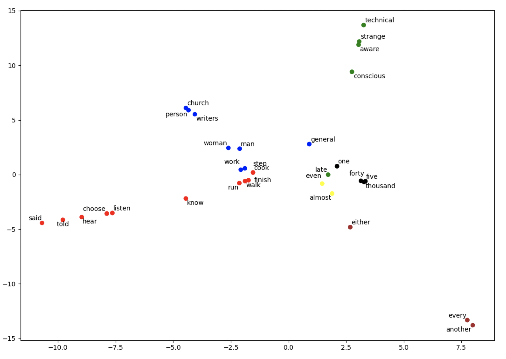
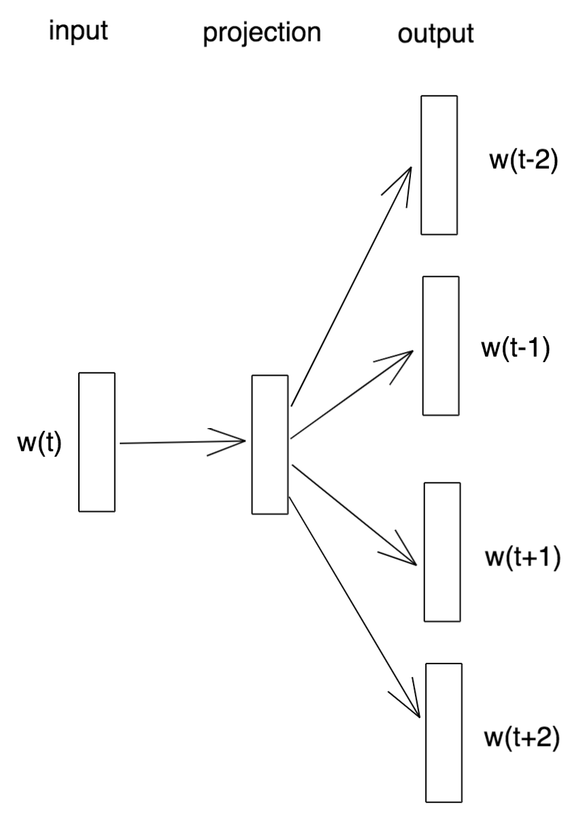
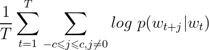
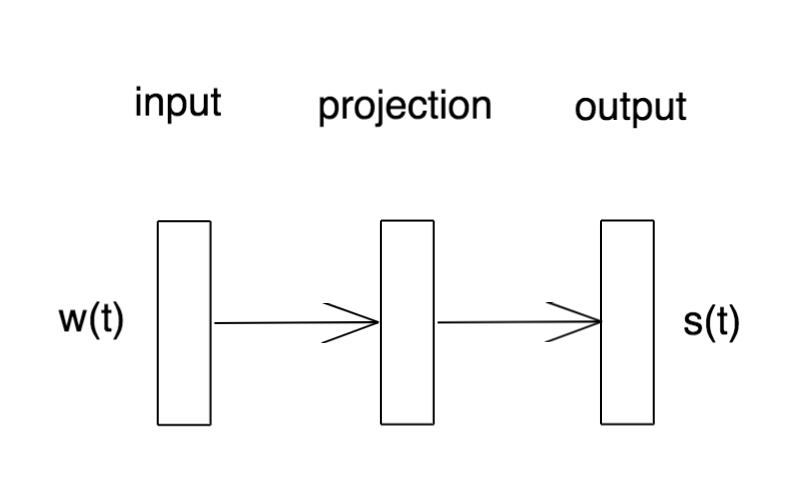
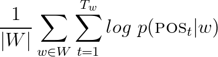

# word2posvec

A Word can have different meanings, depending on the context. Similarly, words can have different parts of speech, depending also on the context. Approaches such as word2vec and GloVe produce distributed word representations according to their semantic content, as given by their proximity to other words. The approach described in this project produces distributed word representations according to their parts of speech. Such representations are useful for tasks such as text classification, where such encodings attach more grammatical information to a word.

For example, take the word "work". In any given corpus, the word may be used as a verb or a noun. Depending on the corpus, it may be used more as a noun, or more as a verb. A distributed word representation that captures the "noun-ness" and "verb-ness" of the word would be useful in a task such as sentence disambiguation, where it is helpful to know how a word might typically be used.

Word embeddings learned by word2vec or GloVe tend to cluster together according to their meaning. Word embeddings learned by word2posvec tend to cluster together according to their part of speech. A word2posvec embedding for the word "work" would lie somewhere between the nouns and the verbs (depending on the corpus).

Plot of learned word2posvec embeddings with 2 components. Red points are verbs, blue points are nouns, black points are 
numbers, green points are adjectives, and yellow points are adverbs.

