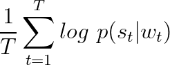

# word2posvec

Plot of learned word2posvec embeddings with 2 components. Red points are verbs, blue points are nouns, black points are 
numbers, green points are adjectives, and yellow points are adverbs.

